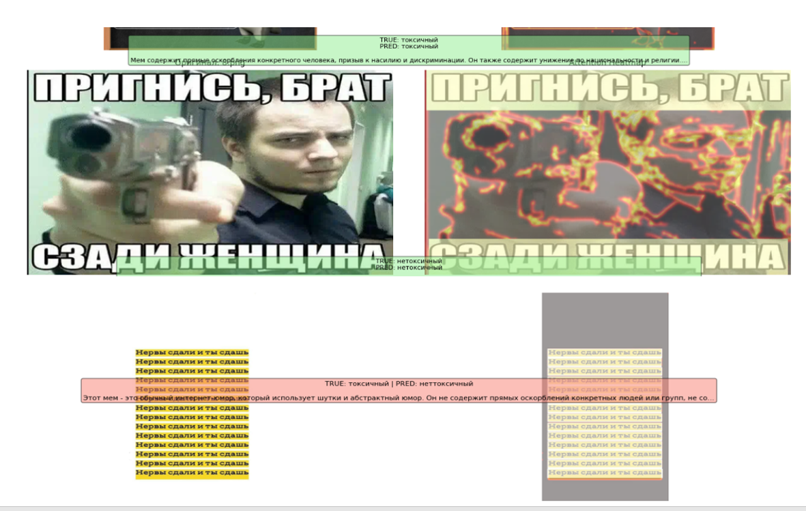

# Использование VLM при классификации токсичных мемов

Эксперимент по анализу того, как мультимодальные модели принимают решения при классификации мемов на токсичные/нетоксичные, с визуализацией и объяснениями.

## Особенности

- **VLM-модель**: Qwen2-VL-2B-Instruct для одновременного анализа изображения и текста
- **Промпт-инжиниринг**: Модель объясняет свои решения на русском языке
- **Attention Heatmaps**: Визуализация областей, на которые модель обращает внимание
- **Анализ уверенности**: Оценка confidence модели (низкая/средняя/высокая)
- **Детальные кейсы**: 10 разобранных примеров с объяснениями и визуализацией
- **Примеры правильных и неверных ответов**.

